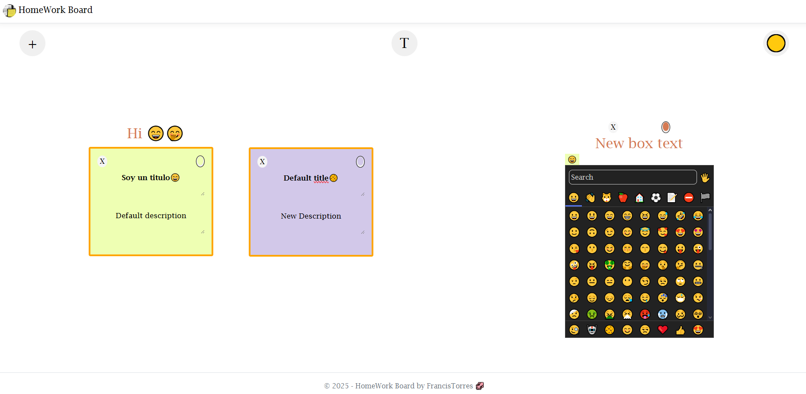

# HomeWork_Board
Tablero de notas y texto. Creado con Jquery UI, Asp.Net MVC y Sqlite.

## Paquetes :cactus:
> JQuery.UI.Combined 1.13.2.

> Microsoft.EntityFrameworkCore 7.0.8.

> Microsoft.EntityFrameworkCore.Design 7.0.8.

> Microsoft.EntityFrameworkCore.Sqlite 7.0.8

> Microsoft.EntityFrameworkCore.Tools 7.0.8

## Notas: 🌎
> Proyecto Asp .Net MVC, creado con Code First, actualmente cuenta con la tabla Task y TextBox.

> Se debe ejecutar el comando  `Add-migration name` y `Update-database`.

## Comandos y pasos necesarios :corn:
> Migración nueva 

PM> `Add-migration name`
PM> `Update-database`

> Agregar tablas o columnas

1> Modificar el archivo DataBase/ApplicationDbContext
`Ejemplo: public DbSet<TaskModel> Task { get; set; }`

2> Agregar modelo en Models/

3> Ejecutar Add-migration "nombre" y Update-database

## Imagenes 👀

